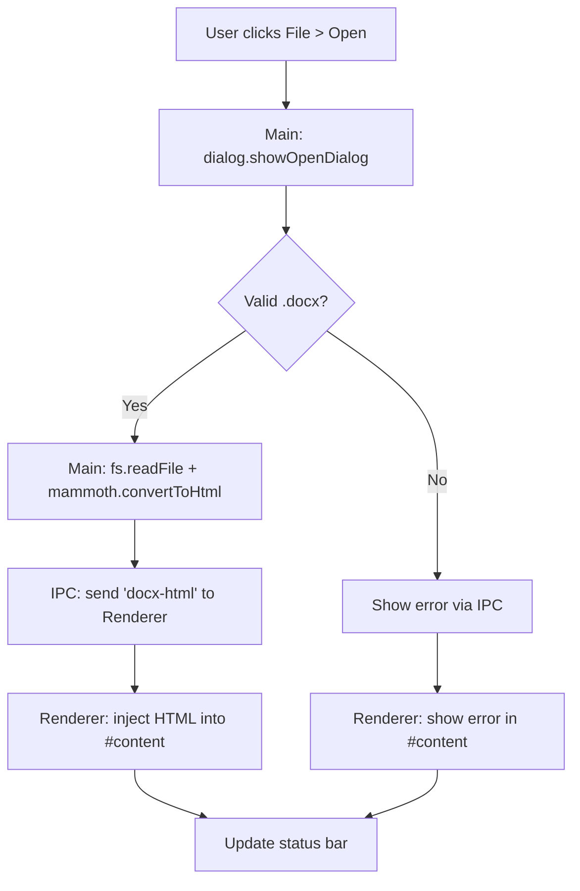

# Electron Docx Viewer Architecture

## Overview

This document outlines the architecture for a minimal viable Electron-based Docx viewer application. The app enables users to open `.docx` files via a file dialog and renders their contents as formatted HTML in the main window using [Mammoth.js](https://github.com/mwilliamson/mammoth.js/), a lightweight library for converting Docx to HTML. 

Key features:
- File open dialog via menu bar (`File > Open`).
- Docx to HTML conversion in the main process.
- Render HTML in a scrollable content area in the renderer process.
- Graceful error handling (e.g., invalid files, conversion errors).
- Cross-platform compatibility (Windows, macOS, Linux).
- Packaged as a standalone desktop app using `electron-builder`.

The app follows Electron's multi-process model:
- **Main process**: Handles window creation, native file dialogs, Docx conversion, and IPC communication.
- **Renderer process**: Displays the converted HTML content.

## File Structure

```
docx-viewer/
├── package.json               # App metadata, scripts, dependencies, electron-builder config
├── src/
│   ├── main/
│   │   ├── main.js            # Main process: window creation, menu, IPC handlers, Docx conversion
│   │   └── preload.js         # Preload script: Secure IPC exposure to renderer
│   └── renderer/
│       ├── index.html         # Renderer entrypoint: Basic UI structure (menu placeholder, content div, status)
│       ├── renderer.js        # Renderer logic: IPC listener, inject HTML into content area
│       └── styles.css         # Basic styling for content rendering and UI
├── assets/
│   └── icon.png               # App icon (512x512 PNG for cross-platform)
├── dist/                      # Output folder for packaged app (generated by electron-builder)
└── ARCHITECTURE.md            # This document
```

## Dependencies

### `package.json` Excerpt

```json
{
  "name": "docx-viewer",
  "version": "1.0.0",
  "description": "Minimal Electron Docx viewer",
  "main": "src/main/main.js",
  "scripts": {
    "start": "electron .",
    "build": "electron-builder",
    "dist": "electron-builder --publish=never"
  },
  "dependencies": {
    "electron": "^latest",
    "mammoth": "^1.6.0"
  },
  "devDependencies": {
    "electron-builder": "^24.13.3"
  },
  "build": {
    "appId": "com.example.docxviewer",
    "productName": "Docx Viewer",
    "directories": {
      "output": "dist"
    },
    "files": [
      "package.json",
      "src/**/*",
      "assets/**/*"
    ],
    "mac": {
      "category": "public.app-category.productivity"
    },
    "win": {
      "target": "nsis"
    },
    "linux": {
      "target": "AppImage"
    },
    "icon": "assets/icon.png"
  }
}
```

- **electron**: Core framework for desktop app.
- **mammoth**: Converts `.docx` (ZIP-based OOXML) to HTML, preserving basic formatting (paragraphs, lists, tables, images, styles).
- **electron-builder**: Packaging tool for cross-platform distributables (DMG, EXE, AppImage).

No additional runtime deps needed for minimal viability.

## High-Level Code Structure

### Main Process (`src/main/main.js`)

```javascript
// Pseudocode
const { app, BrowserWindow, Menu, dialog, ipcMain } = require('electron');
const mammoth = require('mammoth');
const path = require('path');
const fs = require('fs/promises');

let mainWindow;

app.whenReady().then(() => {
  mainWindow = new BrowserWindow({
    width: 1200,
    height: 800,
    webPreferences: { preload: path.join(__dirname, 'preload.js') }
  });
  mainWindow.loadFile('../renderer/index.html');

  const menu = Menu.buildFromTemplate([{
    label: 'File',
    submenu: [{ label: 'Open', click: openFile }]
  }]);
  Menu.setApplicationMenu(menu);
});

async function openFile() {
  const { canceled, filePaths } = await dialog.showOpenDialog({
    properties: ['openFile'],
    filters: [{ name: 'Docx', extensions: ['docx'] }]
  });
  if (canceled || !filePaths[0]) return;

  try {
    const buffer = await fs.readFile(filePaths[0]);
    const { value: html } = await mammoth.convertToHtml({ buffer });
    mainWindow.webContents.send('docx-html', html);
  } catch (error) {
    mainWindow.webContents.send('docx-error', error.message);
  }
}

ipcMain.handle('get-app-version', () => app.getVersion());
```

### Preload Script (`src/main/preload.js`)

```javascript
// Expose safe IPC APIs
const { contextBridge, ipcRenderer } = require('electron');

contextBridge.exposeInMainWorld('electronAPI', {
  onDocxHtml: (callback) => ipcRenderer.on('docx-html', callback),
  onDocxError: (callback) => ipcRenderer.on('docx-error', callback)
});
```

### Renderer Process (`src/renderer/renderer.js`)

```javascript
// Listen for IPC messages
window.electronAPI.onDocxHtml((event, html) => {
  document.getElementById('content').innerHTML = html;
  updateStatus('Document loaded successfully');
});

window.electronAPI.onDocxError((event, error) => {
  document.getElementById('content').innerHTML = `<p style="color: red;">Error: ${error}</p>`;
  updateStatus('Failed to load document');
});
```

### UI (`src/renderer/index.html` + `styles.css`)

- Header: App title.
- Content: `<div id="content"></div>` (scrollable, styled for Mammoth HTML).
- Status: `<div id="status"></div>` (file path, errors).
- Basic CSS for readability (sans-serif font, margins, print-friendly).

## Process Flow Diagram



## Build Instructions

1. **Development**:
   ```
   npm install
   npm start
   ```

2. **Packaging**:
   ```
   npm run build
   ```
   - Outputs to `dist/`: Platform-specific installers.
   - Customize `build` in `package.json` for signing, updates, etc.

3. **Cross-platform**:
   - Run on target OS or use CI (GitHub Actions) with `electron-builder`.

## Assets Needed

- `assets/icon.png`: 512x512 PNG icon (generate via tools like [AppIcon.co](https://appicon.co/) or use placeholder).
- No other assets required for MVP.

## Potential Extensions (Future)

- Pagination/zoom.
- Print support (`window.print()`).
- Search within document.
- Themes/dark mode.
- Advanced Mammoth options (styles mapping).

This architecture ensures a lightweight (~50MB packaged), performant app with clean separation of concerns.